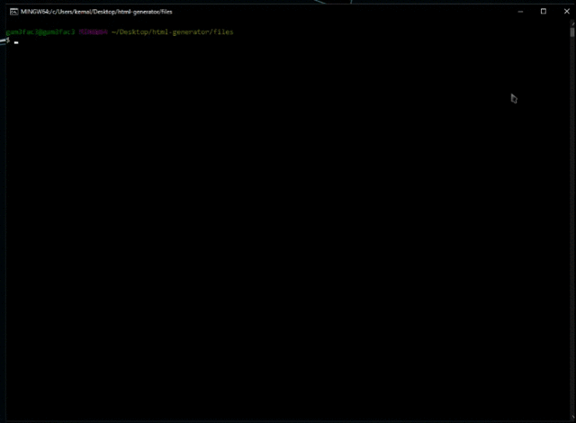

# HTML-GENERATOR

## Description
This is a <ins>HyperText Markup Language(HTML)</ins> file generator that eliminates some extra time on creating and linking the required libraries and frameworks.

## Demo


## Installation
1. Please run the following command on the parent directory to install the dependencies before running the program;
```bash
npm install
```
2. After simply just run the index.js file in the terminal while on the parent directory;
```bash
node index.js
```

## Usage

Please enter the following;

1. File name you desire for generating the *HTML*,
2. Title of the *HTML* file,
3. If *CSS* external link is needed,
4. If *JS* external link is needed,
5. Select the follwing options to include the link in the file:
    * `JQuery`
    * `Bootstrap`
    * `Materialize`
    * `Font Awesome`
6. Selected links & files are generated within the `generated-files` folder.

## Contributing
Pull requests are welcome. For major changes, please open an issue first to discuss what you would like to change. Please contact me through kemal.demirgil@hotmail.com for any questions.

## Roadmap
I am looking forward to create actual HTML templates with built in components using the desired framework, any support towards this idea to contribute to this project is much appreciated since I'm still new to creating `Open Source` projects.

## License
Copyright © Kemal Demirgil. All rights reserved.\
Licensed under the [MIT](https://github.com/kemaldemirgil/autolinks/blob/main/LICENSE) license.
